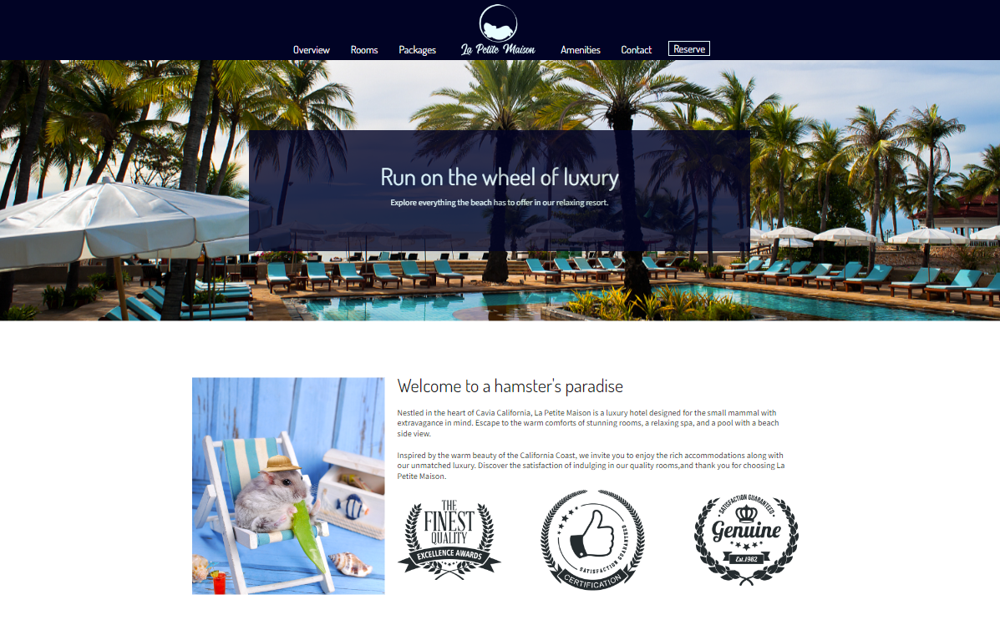

# Hamster Hotel &ensp;

**Name:** Elizabeth Trotter

**Project Note:** I was given a mockup and tasked with making it into a static website using `HTML`, `CSS`, and `Bootstrap`. I was also required to ensure the website was `responsive` for all screen sizes. Although it was a bit of a learning curve working with responsiveness for the first time, I enjoyed the challenge. 

*Also, I am a fellow pet enthusiast :feet: so this was a super fun and cute project to work on!*

**Links**
- Click [Hamster Hotel](https://hamsterhotel-five.vercel.app/) to visit the `deployed website`

- Click [Prototype](https://xd.adobe.com/spec/3e3b745f-aa5a-460e-5fd7-8cc90c248d21-480a/screen/2bce9ed2-c1ed-4a71-ae23-37c1e019d677/Web-1920-1/) 
to visit the original Adobe XD `prototype design`

## Website Preview

---

### Peer Review

> **Name:** Waqas Dad
> **Date/ Time Reviewed:** 11/03/2023 at 9:35 am
> **Comment(s):** Everything looks similar to the prototype link specified including proper placement of images and text. Your hamster hotel website looks amazing. Good job!
